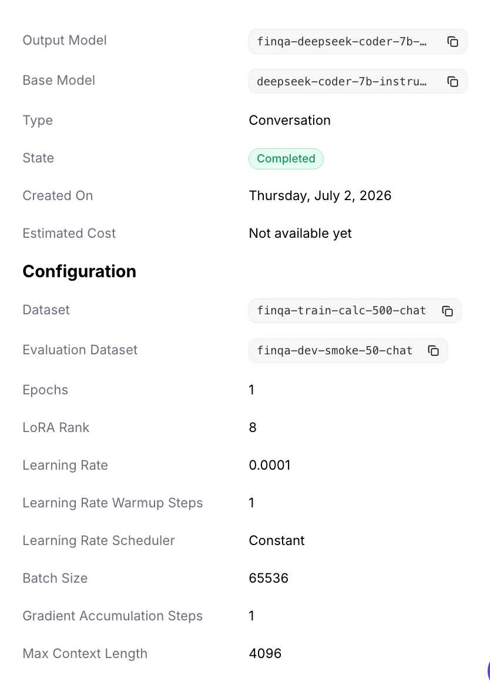
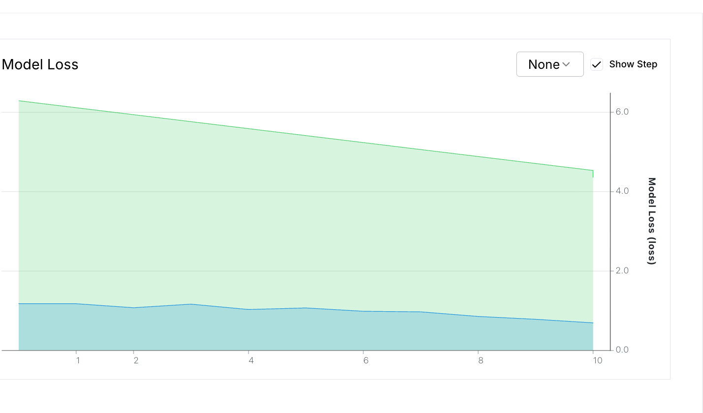
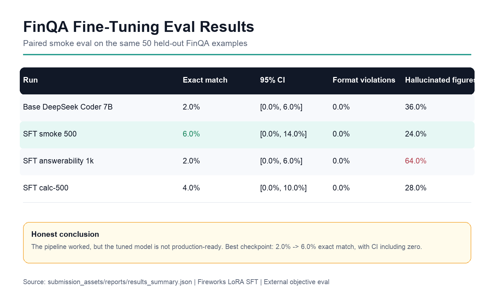
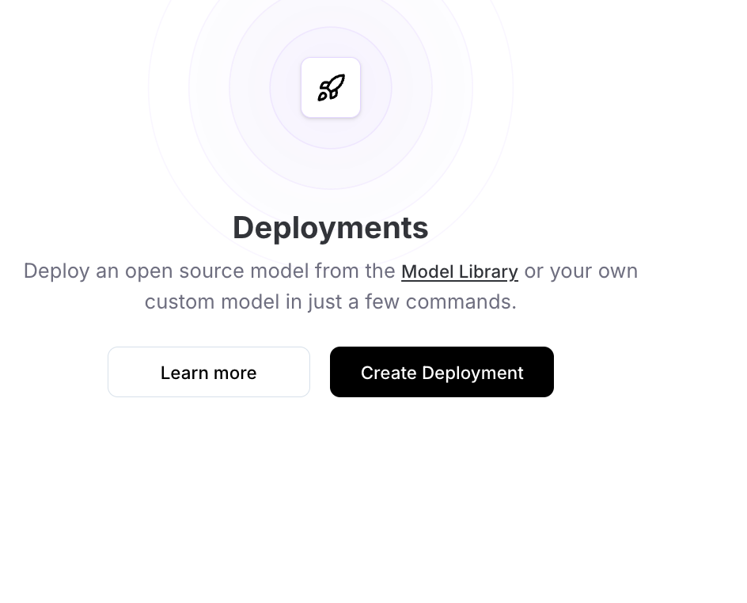
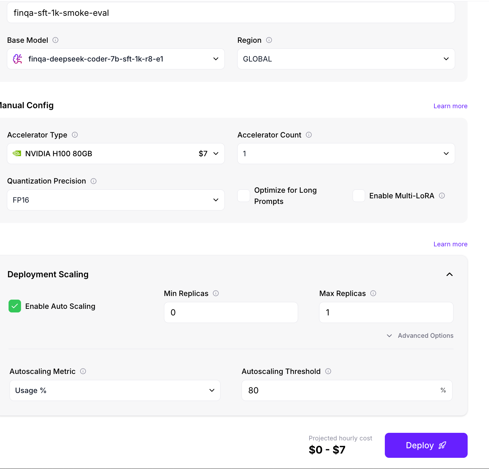

# Demo Walkthrough: FinQA Fine-Tuning Portfolio

Use this as a 3-minute portfolio demo script. The goal is to show the project as a rigorous
fine-tuning system, not just a one-off model demo.

## 0:00-0:20 - Project Intro

Say:

This is my FinQA fine-tuning portfolio project. It is an eval-driven pipeline for financial-document
question answering: data prep, decontamination, chat JSONL, Fireworks LoRA SFT, short-lived
deployments, base-vs-tuned eval, stats, cost tracking, and failure analysis.

Show:

- [README.md](README.md)
- [docs/current_state.md](docs/current_state.md)
- [reports/phase_1_results_summary.md](reports/phase_1_results_summary.md)

Key message:

The project demonstrates methodology and measurement. The current checkpoint is a research
artifact, not a finance-ready assistant.

## 0:20-0:45 - What The Model Does

Say:

The model receives financial report context plus a question and must return a concise answer:

```text
Final answer: <number>
```

This is not just number formatting. The hard part is selecting the correct table row, year, source
numbers, units, and operation.

Example:

```text
Context: Revenue was 120 in 2023 and 100 in 2022.
Question: What was the percentage increase?
Expected: Final answer: 20%
```

Key message:

FinQA tests source-number selection and financial reasoning before arithmetic.

## 0:45-1:10 - Dataset

Say:

I used FinQA, a financial numerical reasoning dataset built from company financial reports. I
normalized raw records, removed train/eval overlap, and converted clean train examples into chat
JSONL for supervised fine-tuning.

Dataset counts:

| Split / subset | Count |
| --- | ---: |
| Raw train examples | 6,251 |
| Dev examples | 883 |
| Test examples | 1,147 |
| Clean train after decontamination | 4,969 |
| Smoke train examples | 500 |
| Smoke eval examples | 50 |

Show:

- [docs/dataset_explanation.md](docs/dataset_explanation.md)
- [reports/dataset_card.md](reports/dataset_card.md)

Key message:

The eval split is held out, and train examples were filtered for overlap before tuning.

## 1:10-1:35 - Fine-Tuning Setup

Say:

I used Fireworks managed LoRA supervised fine-tuning with DeepSeek Coder 7B Instruct v1.5. Runs
were intentionally small: train, deploy briefly, evaluate, delete deployment, and log cost.

Training setup:

| Setting | Value |
| --- | --- |
| Platform | Fireworks |
| Method | Supervised fine-tuning |
| Adapter | LoRA |
| Base model | DeepSeek Coder 7B Instruct v1.5 |
| LoRA rank | 8 |
| Epochs | 1 |
| Learning rate | 0.0001 |
| Max context | 4096 |

Show:





Key message:

This is an end-to-end SFT workflow with cost discipline and teardown, not a prompt-only demo.

## 1:35-2:05 - Evaluation Method

Say:

The primary metric is numeric exact match. The evaluator extracts the model's `Final answer:`,
normalizes financial-number formats, and compares against the gold FinQA answer. I also track
format violations and unsupported figures.

Metric example:

```text
Gold answer: 1200000
Model output: Final answer: $1.2 million
Normalized model answer: 1200000
Score: correct
```

Show:

- [docs/evaluation_methodology.md](docs/evaluation_methodology.md)
- [reports/eval_spec.md](reports/eval_spec.md)

Key message:

The reported score comes from objective grading, not subjective demo impressions.

## 2:05-2:35 - Results

Say:

On the same 50 held-out smoke examples, the base model scored 2.0% exact match. The best tuned
checkpoint scored 6.0%, kept format violations at 0.0%, and reduced unsupported figures from 36.0%
to 24.0%.

Results table:

| Run | Exact match | Format violations | Unsupported figures |
| --- | ---: | ---: | ---: |
| Base DeepSeek Coder 7B | 2.0% | 0.0% | 36.0% |
| Best tuned checkpoint | 6.0% | 0.0% | 24.0% |

Show:



Key message:

The tuned model improved directionally and learned output discipline, but the result is not final
proof. McNemar's exact p-value is 0.5.

## 2:35-2:50 - Why The Result Is Still Hard

Say:

The weak result is technically useful. It shows that the bottleneck is not answer formatting. The
remaining challenge is financial-document reasoning: source-number selection, operation selection,
scale handling, and knowing when evidence is missing.

Show:

- [docs/error_analysis_summary.md](docs/error_analysis_summary.md)
- [reports/failure_analysis.md](reports/failure_analysis.md)

Key message:

The project is honest about model quality and uses failure analysis to choose the next experiment.

## 2:50-3:00 - Conclusion

Say:

The Phase 1 conclusion is that the fine-tuning system works end to end. The next phase should add
better table grounding, source-number supervision, stronger base-model selection, and a
calculator/tool-assisted path where the model chooses inputs and operation while a deterministic
tool handles arithmetic.

Show:





Key message:

This is a complete eval-driven fine-tuning portfolio project with honest results and clear next
steps.

## One-Minute Backup Version

This project fine-tunes a small model for FinQA financial-document question answering. The model
gets financial report context and must return a numeric answer in `Final answer:` format. The hard
part is not number formatting; it is selecting the right table row, year, source numbers, units, and
operation.

I normalized FinQA, decontaminated train/eval overlap, built chat JSONL, ran Fireworks LoRA SFT,
briefly deployed each checkpoint, evaluated base versus tuned on the same 50 held-out examples, and
deleted paid deployments after use.

The base model scored 2.0% exact match. The best tuned checkpoint scored 6.0%, with format
violations at 0.0% and unsupported figures improving from 36.0% to 24.0%. The paired delta is +4.0
points, but McNemar's exact p-value is 0.5, so I present it as a directionally positive research
checkpoint, not final proof.

The next phase should focus on table grounding, source-number labels, better tunable base model
selection, larger evals, and tool-assisted calculation.
