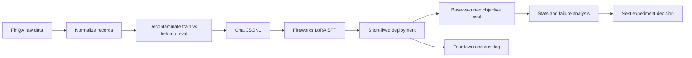

# FinQA Fine-Tuning Portfolio

[](https://github.com/laknarayana9/fine-tuning-pipeline/actions/workflows/ci.yml)

This is an eval-driven fine-tuning portfolio project for financial-document QA using FinQA.

The thesis is methodology: prepare clean financial QA data, decontaminate held-out examples,
create chat JSONL, run cost-controlled Fireworks LoRA SFT, deploy briefly, compare base versus
tuned checkpoints on identical IDs, report statistical uncertainty, analyze failures, and document
what should happen next. The demo is secondary. The defensible eval loop is the product.

The current best checkpoint is the Phase 2 Qwen3 8B source-program SFT with a deterministic
calculator. It is a meaningful portfolio result, but not a finance-reliable model.

## Latest Result (Phase 2 - Qwen3 8B source-program SFT)

Fine-tuning Qwen3-8B to emit source numbers, operation class, and a FinQA program, with a
deterministic calculator executing that program, reached **50.0% exact match** on the locked FinQA
smoke-50 set. That is up from **24.0%** for the Qwen3 direct-answer baseline on the same paired IDs
(**McNemar exact p = 0.01062**, statistically significant on this small set).

Source-number supervision also improved on the prior targeted program SFT (44.0% to 50.0%) and cut
the unsupported-figure rate from 56.0% to 48.0%. That incremental planner-vs-planner gain is
directionally useful, but **not statistically definitive** on only 50 examples.

Full run details, per-subtype breakdown, and failure analysis:
[reports/qwen3_source_program_sft_run.md](reports/qwen3_source_program_sft_run.md). A one-page
summary is available at [reports/latest_result.md](reports/latest_result.md).

## Phase 1 Result (DeepSeek Coder 7B - historical)

These Phase 1 numbers are preserved as the honest starting point. The negative results here,
especially the 1k answerability run, directly motivated the Phase 2 program-planner and
source-program recipes above.

All paired rows below use the same 50 held-out `finqa_dev.smoke_50` examples.

| Run | Exact match | 95% CI | Format violations | Unsupported figures |
| --- | ---: | --- | ---: | ---: |
| Base DeepSeek Coder 7B | 2.0% | [0.0%, 6.0%] | 0.0% | 36.0% |
| SFT smoke 500 | 6.0% | [0.0%, 14.0%] | 0.0% | 24.0% |
| SFT answerability 1k | 2.0% | [0.0%, 6.0%] | 0.0% | 64.0% |
| SFT calc-500 | 4.0% | [0.0%, 10.0%] | 0.0% | 28.0% |

The best Phase 1 checkpoint is the 500-example smoke SFT:

```text
Base exact match: 2.0%
Best tuned exact match: 6.0%
Paired delta: +4.0 percentage points
McNemar exact p-value: 0.5
```

Interpretation: the tuned model learned output discipline and improved directionally on this smoke
slice. The confidence interval still includes zero and McNemar's exact test is not significant, so
this should be treated as a pipeline proof and research checkpoint, not final proof of model
quality.

## Why FinQA Is Hard

FinQA is not just numeric translation. The evaluator can normalize answers such as `$1.2 million`
and `1200000`; the model's harder job is selecting the right source row, year, units, and operation
from financial context.

| Example | What the model must do | Expected behavior |
| --- | --- | --- |
| Revenue grew from `100.0` in 2022 to `120.0` in 2023. | Pick the revenue row, pick the right years, use percentage-change formula. | `(120 - 100) / 100 = 20%` |
| Revenue is `500`, operating income is `75`, net income is `40`. | Use operating income, not net income, and divide by revenue. | `75 / 500 = 15%` |
| Context only includes 2021 and 2022 revenue, but the question asks for 2024 growth. | Detect missing evidence instead of guessing. | `Final answer: not enough information` |

That is why the Phase 2 work focused on table grounding, source-number supervision, operation
selection, and calculator/tool-assisted computation.

## Methodology

The project follows one eval-first loop:



The core evaluation contract is strict:

```text
Final answer: <number, short span, or not enough information>
```

Primary metric:

- Numeric exact match after financial-answer normalization.

Secondary metrics:

- Format violations.
- Unsupported-figure rate.
- Paired base-vs-tuned delta.
- Bootstrap confidence intervals.
- McNemar's exact test for paired binary correctness.

See [docs/evaluation_methodology.md](docs/evaluation_methodology.md) and
[reports/eval_report.md](reports/eval_report.md) for details.

## Why Not Just Tool Calls?

Tool calls are useful, but they do not remove the core FinQA difficulty.

A calculator can reliably compute `75 / 500` once the right inputs and operation are known. The
model still has to read the financial context, choose operating income instead of net income, find
the right year or table column, preserve units, and decide whether the context is sufficient. The
best future architecture is likely hybrid: a tuned model selects evidence and formula structure,
then deterministic tools handle arithmetic, scaling, rounding, and formatting.

This project intentionally measures that boundary. The current best checkpoint improves that
planner-plus-calculator path, while still failing often at source-number and operation selection.

## Why Results Did Not Improve Much

The Phase 1 result is small because the current training recipes mostly taught output behavior, not
robust financial reasoning.

Observed failure modes:

- Source-number selection: choosing a nearby table value, wrong year, or related metric.
- Formula execution: applying the wrong ratio, percentage change, sign, or aggregation.
- Abstention calibration: saying `not enough information` when evidence is present.
- Unsupported figures: emitting a number not supported by the context or computed gold answer.
- Percent/scale handling: confusing ratios, percentages, dollars, millions, or basis units.

The 1k answerability run is especially useful as a negative result. It pushed the model to answer
more often, but exact match stayed at 2.0% and unsupported figures rose to 64.0%. That means the
next step is better grounding, not just more examples or more answer pressure.

See [docs/error_analysis_summary.md](docs/error_analysis_summary.md) and
[reports/failure_analysis.md](reports/failure_analysis.md).

## Next Experiments

Recommended next work:

1. Improve table serialization so rows, years, units, and labels are easier to recover.
2. Continue explicit source-number labels before the final answer.
3. Preserve useful FinQA reasoning traces, but keep targets concise enough for SFT.
4. Build stronger ratio, percent-change, and signed-arithmetic slices.
5. Add balanced abstention examples and an authored unanswerable eval set.
6. Try a stronger tunable base model after confirming current Fireworks availability and pricing.
7. Expand the eval beyond the 50-example smoke slice before claiming model-quality improvement.
8. Add a calculator/tool-assisted path where the model selects inputs and operations, and a tool
   computes the final number.

Do not scale the current DeepSeek Coder recipe to 2k/full-data without a strategy change.

## Repository Map

```text
data/                  Dataset pipeline entry points and generated local JSONL artifacts
deploy/                Fireworks command runbooks and teardown notes
docs/                  Methodology, current state, workflow, and iteration notes
eval/                  Objective eval and prediction CLIs
reports/               Eval reports, failure analysis, model access notes, result summaries
src/finqa_ft/          Pure Python eval/data/provider/stat modules
tests/                 Hermetic unit tests and tiny fixtures
assets/screenshots/    Curated visual evidence from Phase 1 runs
cost_ledger.md         Planned and actual spend log
model_card.md          Model card for current and historical checkpoints
```

## Zero-Spend Quickstart

These commands do not call Fireworks and do not require API keys:

```bash
python -B -m unittest discover -s tests
PYTHONPATH=src python -B eval/run_objective_eval.py tests/fixtures/predictions.jsonl --prediction-field tuned_answer
python data/build_dataset.py normalize-finqa tests/fixtures/finqa_raw_sample.json /tmp/finqa_sample.normalized.jsonl --source-split fixture
python eval/run_predictions.py /tmp/finqa_sample.normalized.jsonl /tmp/finqa_sample.predictions.jsonl --provider offline_first_number
```

The eval harness accepts JSONL rows with at least:

```json
{"id":"ex-1","subtype":"lookup","context":"Revenue was $1.2 million.","gold":"1200000","tuned_answer":"Final answer: $1.2 million"}
```

Network/model providers are gated by `ALLOW_MODEL_CALLS=1`.

## Evidence

Start here:

- [reports/latest_result.md](reports/latest_result.md): one-page summary of the best result.
- [docs/current_state.md](docs/current_state.md): canonical status and run details.
- [docs/phase_1_closeout.md](docs/phase_1_closeout.md): stop-state and resume checklist.
- [reports/phase_1_results_summary.md](reports/phase_1_results_summary.md): compact result summary.
- [reports/phase_1_results_summary.json](reports/phase_1_results_summary.json): machine-readable result summary.
- [docs/dataset_explanation.md](docs/dataset_explanation.md): dataset source, schema, counts, and decontamination.
- [docs/fine_tuning_config.md](docs/fine_tuning_config.md): Fireworks SFT configuration.
- [docs/example_predictions.md](docs/example_predictions.md): tiny public paired examples.
- [DEMO_WALKTHROUGH.md](DEMO_WALKTHROUGH.md): 3-minute portfolio walkthrough.
- [assets/screenshots/README.md](assets/screenshots/README.md): visual proof of SFT, eval, tests, teardown, and cost settings.

## Safety And Cost Discipline

- `.env` is ignored and must not be committed.
- Raw FinQA files and generated prediction files are ignored.
- Paid Fireworks calls are gated and logged.
- Deployments are intentionally short-lived and deleted after eval.
- The current model is not suitable for investment advice, real-time decisions, or production
  financial analysis.
