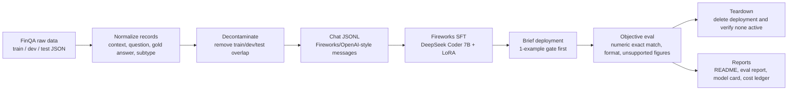

# Architecture Workflow

This project follows a simple eval-first fine-tuning workflow:

```text
FinQA data -> normalize/decontaminate -> chat JSONL -> Fireworks SFT -> deploy -> eval -> teardown
```



## Why This Shape

The evaluation harness is the center of the project. Fine-tuning only matters if the tuned model is
measurably better than the base model on the same held-out examples, and the result is documented
with uncertainty and failure analysis.

The teardown step is part of the architecture because paid Fireworks deployments were intentionally
short-lived. Each deployment was created only for a gate or eval run, then deleted and recorded in
the cost ledger.

## Current Phase 1 Evidence

- Data normalization and decontamination completed for FinQA.
- Fireworks LoRA SFT completed for three small runs.
- Base and tuned checkpoints were evaluated on the same 50 held-out smoke IDs.
- Reports include bootstrap confidence intervals and McNemar's exact test.
- Failure analysis shows source-number selection and formula errors dominate the next phase.
